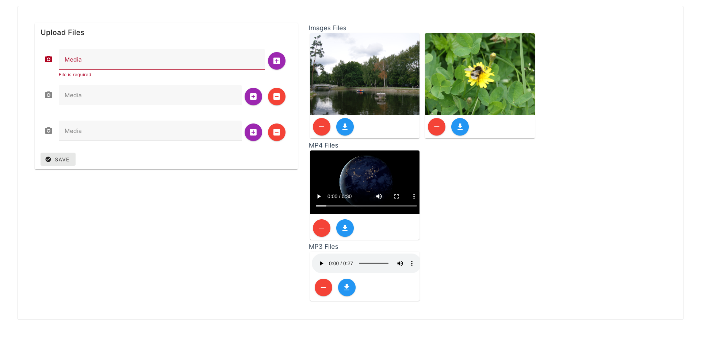

[screenshot]: /media-manager.png

<p align="center">
  <a href="#" target="blank"></a>
</p>

[circleci-image]: https://img.shields.io/circleci/build/github/nestjs/nest/master?token=abc123def456
[circleci-url]: https://circleci.com/gh/nestjs/nest


  <!--[](https://opencollective.com/nest#backer)
  [](https://opencollective.com/nest#sponsor)-->

## Description

[Nest](https://github.com/nestjs/nest) framework TypeScript starter repository.

### Before Start
```
Before installing the node module package please make sure your computer or server must have ffmpeg multimedia frameworrk because inside this project fluent-ffmpeg package used.

Vist below about ffmpeg 
https://ffmpeg.org/download.html

```
## Screnshoot


## Installation


```bash
$ cd media-backend-nestjs
$ npm install
```

## Running the app

```bash

#first Create MYSQL database with name media

#After database creation and connections 
#Run migrate command 

$ npm run migration:run

# development
$ npm run start

# watch mode
$ npm run start:dev

# production mode
$ npm run start:prod
```

## For Vue Application 

## Installation


```bash
$ cd media-frontend-vuejs
$ npm install
```

### Running The app
```bash
$ npm run dev
```
